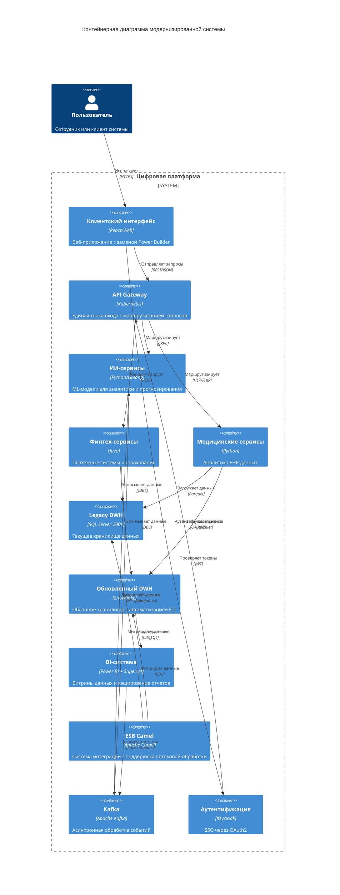

## **Проектирование архитектуры через год**

### **Архитектура системы через год (Диаграмма контейнеров C4)**

### **Проблемные места и приоритизация (MoSCoW)**

| **Категория** | **Проблема**                   | **Описание**                                                     | **Бизнес-эффект**                                     |
| ------------- | ------------------------------ | ---------------------------------------------------------------- | ----------------------------------------------------- |
| **MUST**          | Устаревший DWH                 | SQL Server 2008 не справляется с нагрузкой                       | Задержки отчетности → потеря клиентов                 |
| **MUST**          | Миграция DWH                   | Необходимость параллельного существования Legacy и нового DWH    | Риск потери данных при миграции                       |
| **SHOULD**        | Интеграционная система         | Apache Camel требует модернизации для поддержки высокой нагрузки | Риск потери данных при пиковых нагрузках              |
| **SHOULD**        | ETL-процессы                   | Большая часть времени уходит на ручные трансформации             | Замедление time-to-market                             |
| **COULD**         | Legacy-интерфейс               | Power Builder требует замены                                     | Высокие затраты на поддержку                          |
| **WON’T**         | Монолитная архитектура финтеха | Сложность масштабирования                                        | Пока не критично благодаря разделению на микросервисы |
### **План миграции DWH**
1. **Параллельная работа**:
	- Сохранение Legacy DWH в режиме только для чтения
	- Постепенная миграция данных через CDC
	- Тестовая эксплуатация нового DWH
2. **Этапы миграции**:
	- Миграция справочных данных
	- Миграция транзакционных данных
	- Миграция исторических данных
	- Переключение BI-систем
3. **Технические решения**:
	- Использование Apache Camel для CDC
	- Kafka как буфер между системами
	- Snowflake как целевое хранилище
	- Автоматизация ETL-процессов
### **Преимущества новой архитектуры**
1. **Интеграционная система**:
	- Camel остается для сложных трансформаций и бизнес-процессов
	- Kafka используется как транспорт для асинхронной обработки
	- Разделение ответственностей между системами
	- Возможность постепенного перехода на Kafka Streams
2. **DWH модернизация**:
	- Snowflake обеспечивает:
	    - Автоматическое масштабирование
	    - Оптимизацию хранения
	    - Ускорение обработки запросов
	    - Интеграцию с современными ETL-инструментами
3. **Безопасность и отказоустойчивость**:
	- Многоуровневая аутентификация через Keycloak
	- Репликация данных между зонами доступности
	- Автоматическое восстановление после сбоев
	- Мониторинг всех компонентов системы
