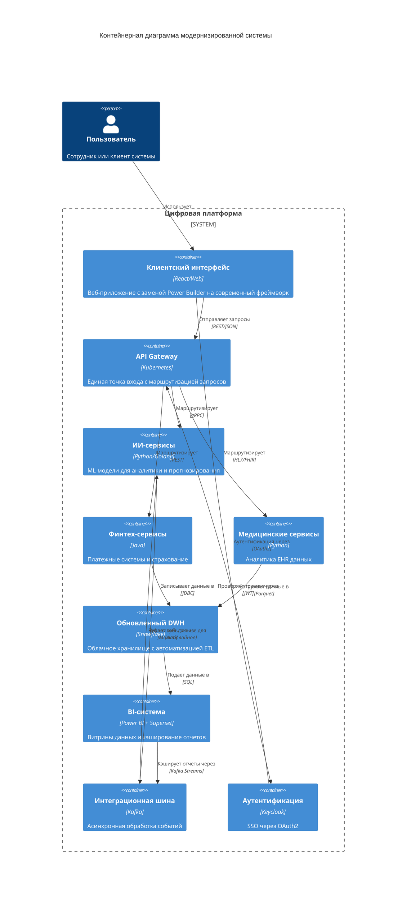

## **Проектирование архитектуры через год**

### **Архитектура системы через год (Диаграмма контейнеров C4)**

### **Проблемные места и приоритизация (MoSCoW)**

| **Категория** | **Проблема**                     | **Описание**                                     | **Бизнес-эффект**                                     |
| ------------- | -------------------------------- | ------------------------------------------------ | ----------------------------------------------------- |
| **MUST**      | Устаревший DWH                   | SQL Server 2008 не справляется с нагрузкой       | Задержки отчетности → потеря клиентов                 |
| **MUST**      | Ручные трансформации данных      | Большая часть времени уходит на ETL-процессы     | Замедление time-to-market                             |
| **SHOULD**    | Медленная интеграция             | Apache Camel не поддерживает потоковую обработку | Риск потери данных при пиковых нагрузках              |
| **COULD**     | Legacy-интерфейс (Power Builder) | Высокие затраты на поддержку                     | Невозможность быстрого обновления функционала         |
| **WON’T**     | Монолитная архитектура финтеха   | Сложность масштабирования                        | Пока не критично благодаря разделению на микросервисы |
