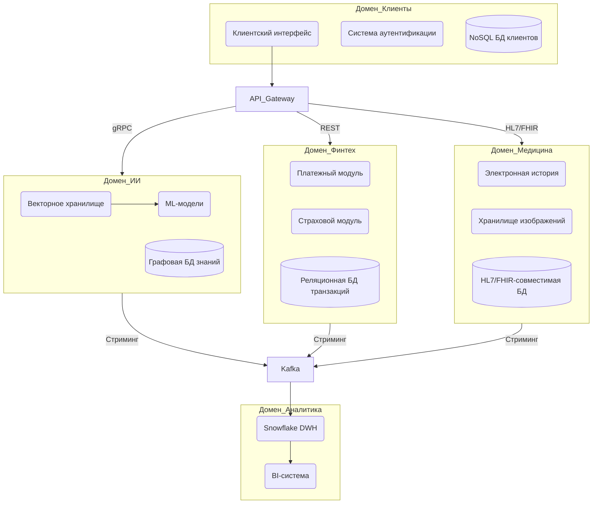
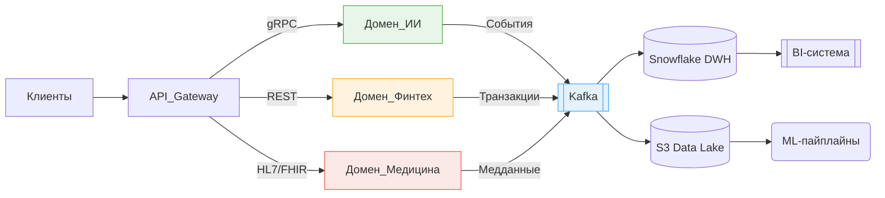

## **Домены**
### **Разделение на домены**

### **Data Flow Diagram с изменениями**

### **Аргументация и преимущества**
**Логика разделения:**
1. **Бизнес-ориентированность**  
    Каждый домен соответствует ключевой бизнес-единице:
	- Финтех: монетизация
	- Медицина: core-продукт
	- ИИ: дифференциация на рынке
2. **Изоляция данных**  
    Медицинские изображения (DICOM) хранятся отдельно от финансовых транзакций, что:
	- Соответствует GDPR/HIPAA
	- Упрощает аудит
3. **Независимое масштабирование**  
    Пиковые нагрузки в страховании не влияют на обработку медицинских данных

**Преимущества для компании:**

| **Аспект**          | **Эффект**                         | **Пример**                                       |
| ------------------- | ---------------------------------- | ------------------------------------------------ |
| Скорость разработки | Большая скорость выпуска новых фич | Обновление страховых тарифов без изменений в DWH |
| Безопасность        | Снижение рисков утечек             | Изоляция PCI DSS данных платежей                 |
| Стоимость владения  | Минус расходы на инфраструктуру    | Оптимизация хранилищ под конкретные домены       |
| Масштабируемость    | Поддержка 10x роста нагрузки       | Автоскейлинг домена ИИ отдельно от основного DWH |
