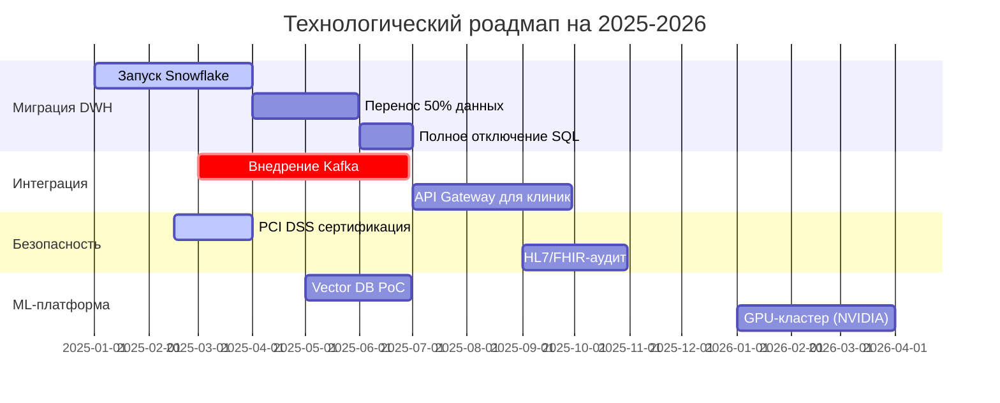

## **Технический радар**

| **Кольцо** | **Технологии/Методологии**                                  | **Статус**           | **Цель внедрения**          |
| ---------- | ----------------------------------------------------------- | -------------------- | --------------------------- |
| **Adopt**  | - Kafka - Snowflake - React - Kubernetes           | Активно используется | Базовая инфраструктура      |
| **Trial**  | - API Gateway - S3 Data Lake - HL7/FHIR-стандарт      | Пилотные проекты     | Унификация интеграции       |
| **Assess** | - Vector DB (Pinecone) - GPU-кластеры - OpenTelemetry | Исследование         | Ускорение ML-моделей        |
| **Hold**   | - SQL Server 2008 - Apache Camel - Power Builder      | Постепенная замена   | Снижение технического долга |
### **Роадмап изменений**

### **Обоснование изменений**
**Этап 1: Миграция DWH** - замена SQL Server 2008 устранит «бутылочное горло» в генерации отчетов
**Этап 2: Внедрение Kafka** - единая шина событий сократит время интеграции новых клиник
**Этап 3: PCI DSS сертификация** - позволит работать с платежами ЕС
**Этап 4: Vector DB PoC** - ускорит обработку медицинских изображений (DICOM) через семантический поиск и повысит точность диагностики